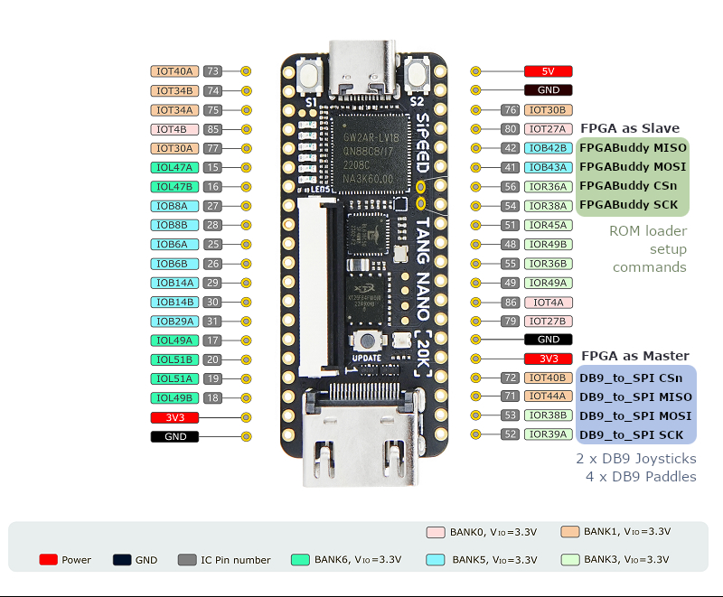

# A2600NanoSAN

_[English](README.md) | [Português](README.pt-BR.md)_

O **A2600NanoSAN** é uma implementação customizada do core Atari 2600 VCS. É baseado no core [A2600Nano](https://github.com/MiSTle-Dev/A2600Nano), que é um port dos componentes de FPGA do [MiSTer Atari 2600](https://github.com/MiSTer-devel/Atari2600_MiSTer). 

Ele foi projetado para a seguinte configuração de hardware:

| Placa | FPGA | Saída de Vídeo | Suporte / Notas |
| --- | --- | --- | --- |
| [Tang Nano 20k](https://wiki.sipeed.com/nano20k) | [GW2AR](https://www.gowinsemi.com/en/product/detail/38/) | HDMI | Placa Companion FPGABuddy + Placa DB9-para-SPI |

Este projeto requer a conexão de uma placa coprocessadora customizada executando um firmware dedicado: [FPGABuddy](https://github.com/sandrobenigno/FPGABuddy).

## Principais Recursos

Esta versão customizada do core A2600Nano introduz vários recursos principais:
* **Suporte a Cartuchos Físicos**: Capacidade de ler cartuchos físicos do Atari 2600 usando os slots de cartucho do FPGABuddy.
* **Navegação na Tela (OSD)**: Interface de usuário fluida navegada através de um encoder rotativo e uma tela LCD de caracteres hospedados na placa FPGABuddy.
* **Controles Clássicos (Legacy)**: Portas duplas de joystick DB9 e suporte para até quatro paddles analógicos com latência ultra-baixa através do módulo customizado [db9_to_spi_san.v](src/db9_to_spi_san.v).
* **Tela de Abertura (Splash Screen)**: Uma ROM interna customizada que atua como tela de abertura enquanto aguarda a transmissão das imagens de jogos externos.

---

## Detalhes do Core e Módulos Customizados

### 1. Integração com FPGABuddy SD Card e Leitor de Cartuchos

O core **A2600NanoSAN** depende do **FPGABuddy**, uma placa coprocessadora externa construída em torno de um microcontrolador **Raspberry Pi Pico (RP2040)**. Em vez de implementar a lógica complexa de sistema de arquivos FAT32 e cartão SD no FPGA, o RP2040 atua como o Mestre SPI:

* **Transmissão Direta de ROM ([spi_loader_san.v](src/spi_loader_san.v))**: Quando um jogo é selecionado, o FPGABuddy coloca a linha de Chip Select do FPGA (`GP17` no Pico, Pin 56 na Tang Nano 20k) em nível LOW e envia o **Target 0x03 (SDC)** seguido pelo **Command 0x08 (ROM_STREAM)**.
* **Controle de Reset do FPGA**: O módulo escravo do FPGA (`spi_loader_san.v`) intercepta este comando, ativa o sinal `ioctl_download` para manter a CPU do Atari em Reset e transmite os dados da ROM diretamente para a RAM do mapper do FPGA ([Gowin_SDPB](src/gowin_sdpb/gowin_sdpb_san.vhd)).
* **Inicialização Automática**: Assim que a transmissão é concluída e o Chip Select vai para HIGH, o FPGA retira a CPU do Atari do estado de Reset, iniciando o jogo instantaneamente.
* **Leitura de Cartuchos Físicos**: O FPGABuddy possui pinos leitores de cartuchos dedicados no RP2040 configurados em modo escravo. As ROMs dos cartuchos físicos são lidas externamente e transmitidas para a RAM interna do FPGA via SPI, permitindo o suporte a cartuchos reais do Atari 2600.
* **Resolução de Tri-state do MISO**: A saída MISO do FPGA é mantida em alta impedância (`'Z'`) sempre que o Chip Select está inativo (HIGH), permitindo que o FPGABuddy compartilhe o barramento SPI0 com o seu leitor de cartão SD onboard sem conflitos elétricos.

### 2. Controlador DB9-para-SPI de Ultra-Baixa Latência

A entrada do controle físico é gerenciada por uma placa externa customizada **DB9-para-SPI** executando um Arduino como Escravo SPI. Isso substitui a lógica padrão do controle DualShock 2 para interfacear com dois joysticks clássicos DB9 do Atari e até quatro paddles analógicos.

O módulo mestre do controlador [db9_to_spi_san.v](src/db9_to_spi_san.v) no FPGA opera a **~720 kHz** (derivado do clock do core de 28.8 MHz dividido por 20, MSB-first, SPI Mode 3) e implementa **Smart Polling Agressivo**:

* **Leitura no VBlank (Comando 0x02, 2 Bytes)**: Acionado em cada borda de subida do **VSYNC** (sempre, tanto no modo joystick quanto paddle). Ele lê todas as direções do joystick e botões de ação (Byte 0: Joy1+Botões, Byte 1: direções/botões do Joy2). A transmissão leva apenas **22.2 µs**.
* **Leitura Rápida na Linha de Varredura (Comando 0x01, 4 Bytes)**: Acionado em cada borda de subida do **HSYNC** (apenas se `paddle_mode` estiver ativo). Ele lê apenas as posições dos 4 paddles analógicos, omitindo completamente os dados dos botões para minimizar o tempo de transmissão para **44.4 µs** (criando uma margem de segurança confortável de **19 µs** dentro da janela da linha de varredura de **63.5 µs**). O Modo Joystick desativa completamente a leitura por HSync, reduzindo as interrupções do SPI no microcontrolador em **99.8%**.

### 3. LED de Status RGB Multicolorido (WS2812)

A placa companion atualiza o LED de status WS2812 integrado no FPGA (Pin 79) enviando um pacote SPI de 5 bytes (Target 0, Command 2) para [sysctrl.v](src/misc/sysctrl.v) contendo um valor de cor de 24 bits. A cor reflete o estado atual da máquina de estados global do FPGABuddy:

1. **STATE_SELECIONANDO (Menu de ROMs)**: O LED onboard brilha em **Verde** (`rgb(0, 127, 0)`).
2. **STATE_JOGANDO (Console Ativo)**: O LED onboard brilha em **Azul** (`rgb(0, 0, 127)`).
3. **STATE_CONFIGURANDO (Configurações do OSD)**: O LED onboard brilha em **Vermelho** (`rgb(127, 0, 0)`).

---

## Alimentação

O sistema deve ser alimentado usando uma **fonte de alimentação de 5V e 2A** conectada via USB-C tanto na placa FPGABuddy quanto na Tang Nano 20k. Isso garante corrente suficiente para alimentar o core do FPGA, saída HDMI, o RP2040, a tela LCD e o leitor de cartuchos externo.

---

## Síntese

O código fonte pode ser sintetizado, mapeado e programado usando o GOWIN IDE no Windows ou Linux. Alternativamente, utilize o script de build por linha de comando: `gw_sh.exe build_tn20k_san.tcl`.

---

## Considerações de Hardware (Circuitos)

### Mapeamento de Pinos da Tang Nano 20k para FPGABuddy (MCU SPI)
| Pino FPGA | Nome do Sinal no Core | Função | Direção |
| :--- | :--- | :--- | :--- |
| **41** | `fpgabuddy_mosi` | SPI MOSI | Entrada |
| **42** | `fpgabuddy_miso` | SPI MISO | Saída |
| **54** | `fpgabuddy_sclk` | SPI SCK | Entrada |
| **56** | `fpgabuddy_csn`  | SPI CSn | Entrada |
| **51** | `fpgabuddy_irqn` | IRQn de Interrupção | Saída |

### Mapeamento de Pinos da Tang Nano 20k para a Placa DB9-para-SPI (SPI do Controle)
| Pino FPGA | Nome do Sinal no Core | Função | Direção |
| :--- | :--- | :--- | :--- |
| **52** | `db9_spi_sclk` | SPI SCK | Saída |
| **53** | `db9_spi_mosi` | SPI MOSI | Saída |
| **71** | `db9_spi_miso` | SPI MISO | Entrada |
| **72** | `db9_spi_csn`  | SPI CSn | Saída |

*Nota: Os pinos da segunda porta física de gamepad (anteriormente `ds_clk_ms20k`, etc. nos pinos 73, 74, 77 e 31) foram completamente removidos e liberados do core do FPGA.*
